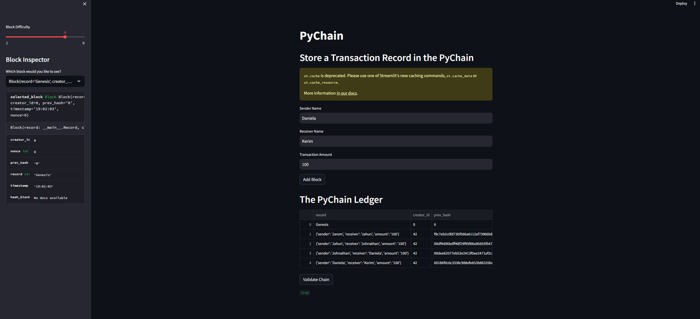
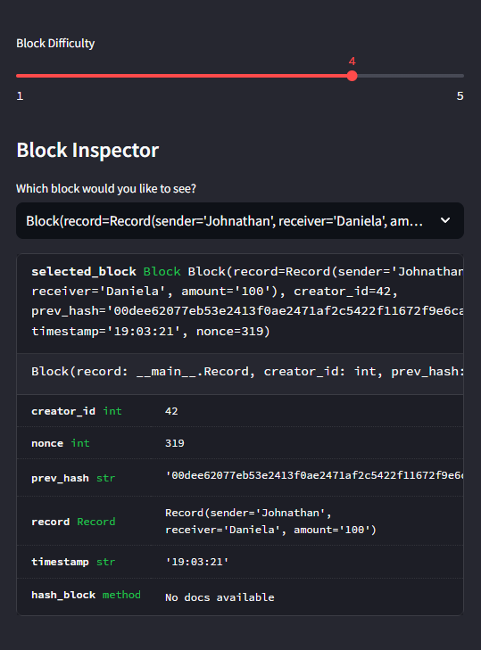

# Pychain_ledger

The pychain.py file includes the setup to run a Blockchain creation program via Streamlit. In the terminal, run the Streamlit application by using the command `streamlit run pychain.py` while in the folder containing pychain.py.

Once running, you will be able to add a sender, receiver, and amount for your transaction, then add it to a new block. After, you may verify the chain with the 'Validate Chain' button. An example is shown here:

  

You will also notice on the sidebar an area to up the difficulty of mining, and a detailed output of each block from the dropdown menu:

  
